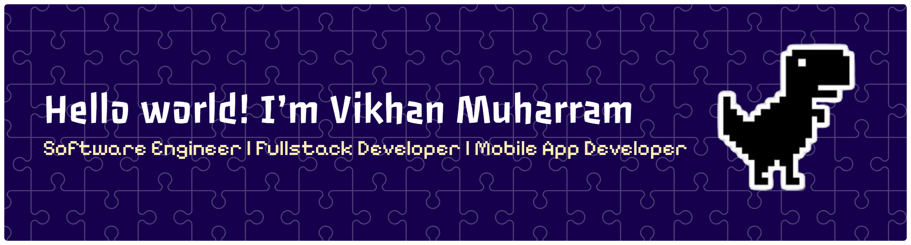

---

### 🚀 About Me  
- 🎓 Bachelor of Software Engineering — *Telkom University*  
- 💼 Experienced in **Laravel**, **Angular**, **Flutter**, **Node.js**, **TS-Node**, **Express**, and **MongoDB**  
- 🔍 Love analyzing systems and designing clean architecture using **UML**  
- 🧠 Currently exploring **AI integration** and **Vibecoding**  
- 🌱 Always curious about new tech and improving user experience  

---

### 💡 Featured Projects  
🩺 **RSHS Helpdesk System** – Laravel-based hospital helpdesk platform improving complaint management efficiency by 100%.  
🎱 **BBS Pool & Café App** – Flutter + Firebase app for billiard table booking and store management.  
🧭 **AIGO Web Platform** – Laravel & Flask integration for tourism ticketing and outdoor equipment rental.  

---

### 🧰 Tech Stack  
**Backend & Framework:**  

**Frontend:**  

**Database:**  

**Tools:**  

---

### 📈 GitHub Stats  
  

---

### 📫 Connect with Me  

---

⭐ *“Code with purpose. Design with empathy.”*

---

<!-- ### Let’s play! 🎯

<picture>
  <source media="(prefers-color-scheme: dark)" srcset="https://raw.githubusercontent.com/vikhanmuhammad/vikhanmuhammad/output/pacman-contribution-graph-dark.svg">
  <source media="(prefers-color-scheme: light)" srcset="https://raw.githubusercontent.com/vikhanmuhammad/vikhanmuhammad/output/pacman-contribution-graph.svg">
  
</picture>

### -->

###

###
